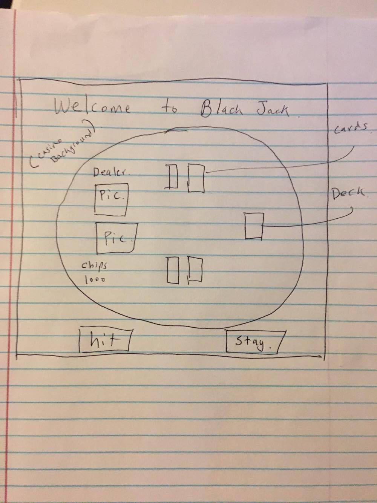

# blackjack

**Description**: Black jack will be a user friendly game where
    people can practice "hit" and "stay". The game will initiate with a 
    simple black jack table background with a deck of card on the side, and with
    4 boxes (two slot for user and two slot for dearler). The card will be 
    distributed between the dealer/user and the user will have two options
    of "hit" or "stay". If hit/stay is clicked, an additional card will be dealt/
    not dealt to the user and the black jack rule will be used for programming
    with javascript.
   
**Tech used**: html5, css3, javascript, jquery
    
**Installation instructions**: play on your browser, clone my repo
    
**links**: https://github.com/da1271/blackjack  ,   https://trello.com/b/eCTDKrOC/wdi-sm-43-project-1
    
**Unsolved Problems**: Was unable to add a betting system. (just practice counting cards please.)
    

